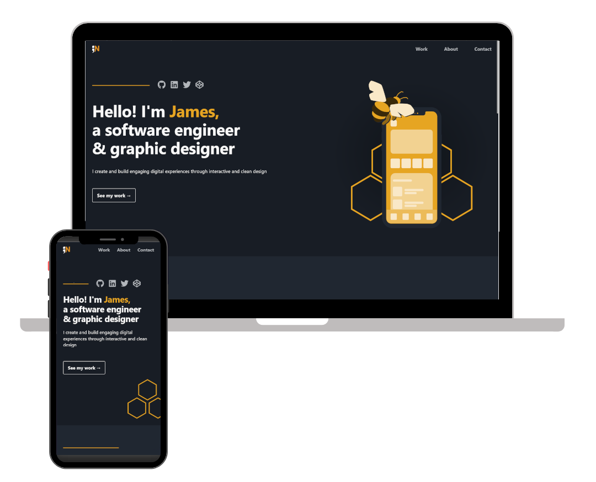

<h2 align="center">
  Portfolio Website - v2.0 
  <a href="https://jamesneff.com" target="_blank">jamesneff.com</a>
</h2>

  

<h3 align="center">
    &#x2B21;
    <a href="https://github.com/NeffCodes/Portfolio-v2.0/issues">Report Bug</a> &nbsp; &nbsp;
    &#x2B21;
    <a href="https://github.com/NeffCodes/Portfolio-v2.0/issues">Request Feature</a>
</h3>

___

This is my personal portfolio [website](https://jamesneff.com) which features some of my projects as well as my technical skills, designed and coded by me.

## Built With

This project was built using these technologies and tools.

- Next.js
- Framer Motion
- CSS3
- Netlify
- Figma
- VsCode
